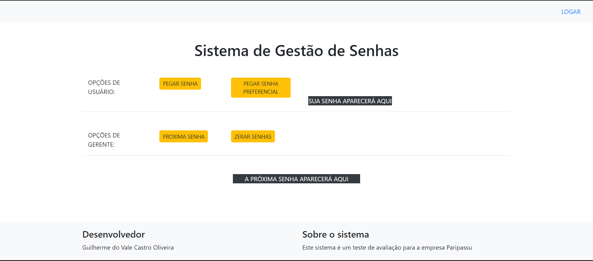

# TesteParipassuGestaoSenhaCliente

Sistema de gestão de senhas para resolução do teste da empresa Paripassu - Parte Cliente

A linguagem Back-end utilizada é o Java com os frameworks Spring boot e Security.

As linguagens front-end utilizadas foram HTML e CSS ultizando o Bootstrap 4.0 e Thymeleaf.

O Administrador de banco de dados utilizado é o Postgres 4.26

Passos para execução:

1- Executar com uma IDE com suporte a Java e Maven, de preferência o Eclipse.

2- Baixar a pasta do projeto e abrir como projeto Maven.

3- Caso necessario baixar os arquivos pelo Maven através dos goals: "clean package"

4- Clique com o botão direito no arquivo /gestaoDeSenhaCliente/src/main/java/com/teste/paripassu/gestaoDeSenhaCliente/GestaoDeSenhaClienteApplication.java dentro da IDE e 
clique em "RUN AS JAVAAPLICATTION"

5- O browser recomendado para rodar é o Google Chrome (onde foi testado)

6- Para acessar a pagina é necessário acessar o localhost na porta 9090 (http://localhost:9090/index ou http://localhost:9090/)

O cliente estará rodando e apresentará a seguinte tela:

Como não consegui colocar a separação entre USUÁRIOS e GERENTE acabei colocando as 2 opções funcionais na própria tela inicial.

Opções de Usuário: O usuário comum pode ser um cliente comum ou preferencial. Os botões de tirar senha de cada um dos 2, ao ser apertado, imprime a senha correspondente na ordem correta. A senha de cada um é mostrada na label de fundo preto ao lado dos botões.

Opções de Gerente: O gerente, como requerido, não retira uma senha, mas pode zerar as senhas ou chamar a próxima senha clicando nos botões correspondentes. Ao chamar a próxima senha a ordem segue a de cada usuário que resgatou a sua senha como o requerido. Caso não tenha próxima senha será informado no label aonde aparecem as senhas.

Logar: O link de logar no canto superior direito leva a uma tela de login, mas ela não faz o login ainda.
